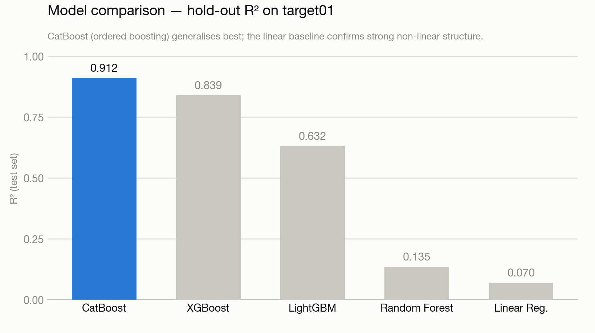

# Problem 41 — Regression & Interpretable Modeling

Two complementary machine-learning tasks on the same anonymised tabular dataset
(~272 numeric features, 10,000 rows). Task 1 optimises for **predictive accuracy**;
Task 2 optimises for **interpretability**.

| Task | Target | Objective | Deliverable |
|------|--------|-----------|-------------|
| **Task 1** | `target01` | Best-accuracy regression | `EVAL_target01_41.csv` (predictions) |
| **Task 2** | `target02` | A human-readable model | `framework.py` (rule engine) |

---

## Task 1 — Accuracy-first regression · [`task_1.ipynb`](task_1.ipynb)

An end-to-end regression pipeline:

1. **Load & assemble** features and targets.
2. **Train / test split** (80 / 20, fixed seed).
3. **Feature typing** — every anonymised column is classified from its values into
   *binary*, *integer*, *bounded-[0,1]*, or *float*.
4. **Feature selection** — the 150 most important features are kept using Random
   Forest importances.
5. **Model comparison** — XGBoost, CatBoost, LightGBM, Random Forest and Linear
   Regression are trained and compared on the hold-out set.
6. **Evaluation** — the best model (**CatBoost, ordered boosting**) scores the
   unlabeled `EVAL_41.csv`; predictions are written to `EVAL_target01_41.csv`.

### Results



| Model | Test R² | Train R² |
|-------|:-------:|:--------:|
| **CatBoost** (ordered boosting) | **0.912** | 0.962 |
| XGBoost | 0.839 | 0.968 |
| LightGBM | 0.632 | 0.829 |
| Random Forest | 0.135 | 0.882 |
| Linear Regression | 0.070 | 0.088 |

CatBoost generalises best on the hold-out set (RMSE ≈ 0.072). The near-zero linear
baseline confirms the signal is strongly non-linear, which is why the gradient-boosted
tree ensembles dominate.

## Task 2 — Interpretable rule model · [`task_2.ipynb`](task_2.ipynb)

Rather than a black box, `target02` is modeled with a tiny, transparent rule set:

1. Fit a decision tree and read its **feature importances**.
2. Discover that four features dominate: `feat_187`, `feat_64`, `feat_126`, `feat_53`.
3. Refit a **depth-1 tree** on those features and extract the split as rules, with a
   linear fit inside each leaf:

   ```
   if feat_187 <= 0.7 :  target = -0.173·feat_187 - 1.594·feat_64 + 0.358·feat_126 - 0.571·feat_53 + 0.089
   if feat_187 >  0.7 :  target =  0.15·feat_64 + 1.85·feat_126 + 1.05·feat_53
   ```

These `(condition, formula)` pairs are executed by **`framework.py`**.

---

## Repository layout

```
.
├── task_1.ipynb            # Task 1 — accuracy-first regression
├── task_2.ipynb            # Task 2 — interpretable rule extraction
├── framework.py            # Task 2 rule engine (applies the extracted rules)
├── evaluate_framework.py   # Scores framework.py against the true target02 (MSE / R²)
├── EVAL_target01_41.csv    # Task 1 submission (predictions for EVAL_41.csv)
├── problem_41/
│   ├── dataset_41.csv      # Training features
│   ├── target_41.csv       # Labels (target01, target02)
│   └── EVAL_41.csv         # Unlabeled evaluation features
├── requirements.txt
└── README.md
```

## Getting started

```bash
python -m venv venv && source venv/bin/activate
pip install -r requirements.txt

# Reproduce the notebooks
jupyter notebook            # open task_1.ipynb / task_2.ipynb

# Run the Task 2 rule engine on the evaluation set
python framework.py --eval_file_path problem_41/EVAL_41.csv

# Check the rules against the true target02
python evaluate_framework.py
```